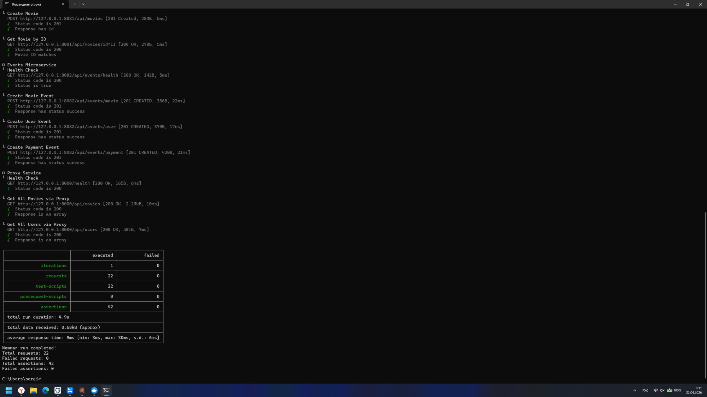
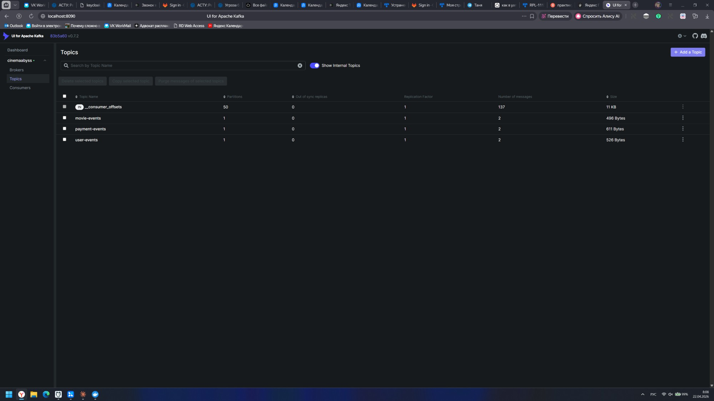
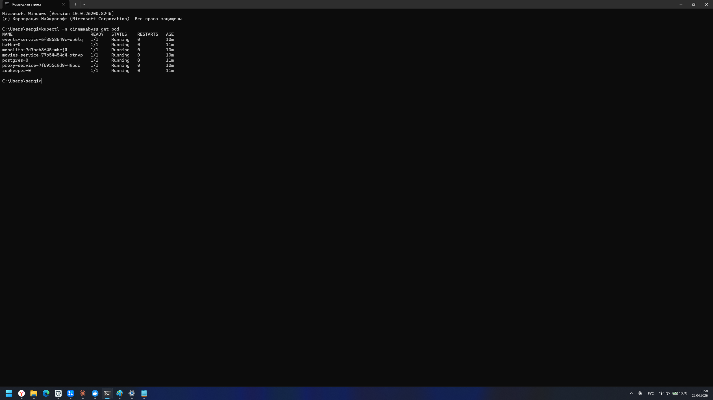
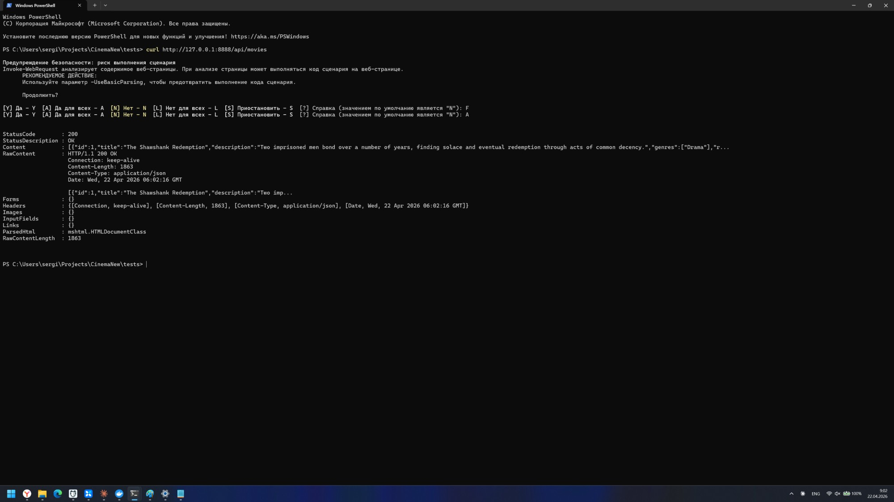
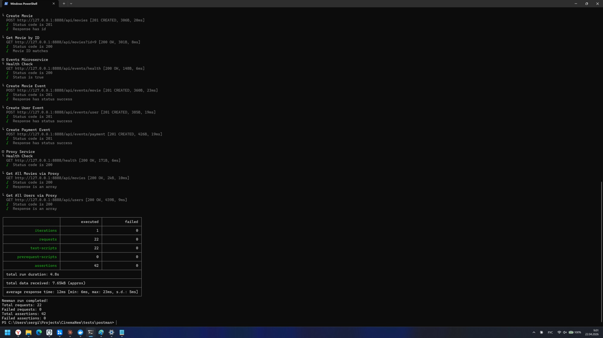
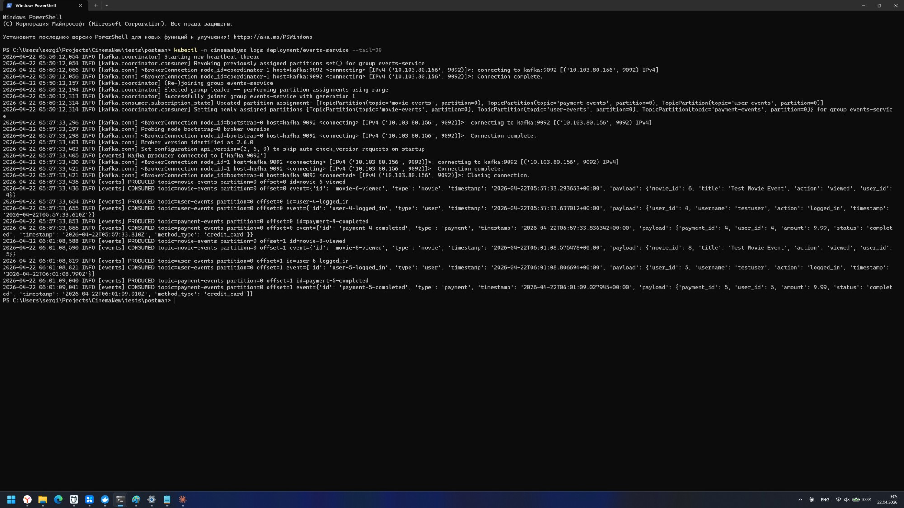

## Изучите [README.md](.\README.md) файл и структуру проекта.

# Задание 1

1. Спроектируйте to be архитектуру КиноБездны, разделив всю систему на отдельные домены и организовав интеграционное взаимодействие и единую точку вызова сервисов.
Результат представьте в виде контейнерной диаграммы в нотации С4.
Добавьте ссылку на файл в этот шаблон

## Проделанная работа

Проанализирована AS-IS архитектура (Go-монолит + единая PostgreSQL + RabbitMQ к внешней рек. системе + S3 + платёжная система + онлайн-кинотеатры). Спроектирована TO-BE архитектура с декомпозицией монолита на домены, Database-per-Service, событийной интеграцией через Kafka и единой точкой входа.

## Выделенные домены

- **Identity & Users** — `auth-service`, `user-service`.
- **Catalog & Engagement** — `movies-service` (метаданные), `ratings-service` (оценки), `favorites-service` (избранное), `content-service` (ссылки на источники контента, S3).
- **Billing** — `subscriptions-service`, `payments-service`, `discounts-service` (скидки/лояльность).
- **Integration** — `recommendations-adapter` (мост к внешней рек. системе), `events-service` (MVP Kafka), `notifications-service`.
- **Legacy** — `monolith` остаётся на время миграции; постепенно «удушается» паттерном Strangler Fig.

Каждый сервис владеет своей схемой в PostgreSQL (DB-per-service). Асинхронная интеграция — через Kafka-топики `movie-events`, `user-events`, `payment-events`, `subscription-events`.

## Единая точка вызова

На входе — **API Gateway** (NGINX Ingress + Proxy-сервис на Go):

- TLS-терминация и один публичный домен для всех клиентов.
- Маршрутизация по типу клиента в соответствующий **BFF** (Web / Mobile / Smart TV) — разные агрегации и объём payload'а под разные устройства.
- **Strangler Fig** — фиче-флаг `MOVIES_MIGRATION_PERCENT` переключает процент трафика с монолита на выделенный микросервис; позволяет бесшовный переход без простоя.

[C4 Container diagram — TO-BE](./docs/architecture/tobe-container.md)

# Задание 2

### 1. Proxy

Реализован прокси-сервис (API Gateway) по паттерну **Strangler Fig** — в `src/microservices/proxy/` (Python 3.12 / Flask + requests + waitress). Сборка и запуск через docker-compose (порт `8000`).

**Маршрутизация:**

| Путь | Поведение |
|---|---|
| `GET /health` | `200 text/plain "Strangler Fig Proxy is healthy"` |
| `/api/movies*` | `GRADUAL_MIGRATION=true` → `MOVIES_MIGRATION_PERCENT`% трафика в `movies-service`, остальное — в монолит. `GRADUAL_MIGRATION=false` → 100% в `movies-service` (миграция домена завершена). |
| `/api/events*` | → `events-service` |
| `/api/users`, `/api/payments`, `/api/subscriptions`, остальное | → монолит |

**Выполненные пункты задания:**

- ✅ Сервис реализован в `./src/microservices/proxy`.
- ✅ Сборка через docker-compose работает, конфигурация соблюдена (env `MONOLITH_URL`, `MOVIES_SERVICE_URL`, `EVENTS_SERVICE_URL`, `GRADUAL_MIGRATION`, `MOVIES_MIGRATION_PERCENT`).
- ✅ Postman-тесты `npm run test:local` — **18/18 зелёных**, падают только 4 теста секции Events (сервис не реализован, это ожидаемо для части 1). Итого: Monolith 11/11, Movies 4/4, Proxy 3/3.
- ✅ Запрос `curl http://localhost:8000/api/movies` возвращает массив фильмов.
- ✅ Постепенный переход проверен: при `MOVIES_MIGRATION_PERCENT=50` 10 последовательных запросов распределились 6 в монолит / 4 в `movies-service` (проверка по логам `get movies from monolith` vs `get movies from movies`).


### 2. Kafka

Реализован MVP сервис `events` в `src/microservices/events/` (Python 3.12 / Flask + `kafka-python-ng` + waitress). Сервис одновременно **producer и consumer**: API-хендлеры публикуют событие в Kafka-топик, фоновый поток с `KafkaConsumer` читает все три топика и логирует полученные сообщения.

**API:**

| Эндпоинт | Топик |
|---|---|
| `GET /api/events/health` | — |
| `POST /api/events/movie` | `movie-events` |
| `POST /api/events/user` | `user-events` |
| `POST /api/events/payment` | `payment-events` |

Ответ по контракту: `{status:"success", partition, offset, event}`.

**Выполненные пункты задания:**

- ✅ Сервис реализован в `./src/microservices/events` на Python.
- ✅ Producer и Consumer работают в одном процессе; события обрабатываются внутри сервиса с записью в лог (`PRODUCED …` / `CONSUMED …`).
- ✅ API создаёт события User / Payment / Movie.
- ✅ Сервис добавлен в `docker-compose.yml` (порт `8082`, `KAFKA_BROKERS=kafka:9092`).
- ✅ Postman-тесты `npm run test:local` — **22 requests / 42 assertions, 0 failed**.

**Скриншоты:**

Newman summary:



Kafka UI (`http://localhost:8090`) — топики `movie-events`, `user-events`, `payment-events`:




# Задание 3

## CI/CD

Доработан `.github/workflows/docker-build-push.yml`:

- Добавлены шаги `Extract metadata` + `Build and push` для **events-service** и **proxy-service** (к уже имевшимся monolith / movies).
- Триггер расширен на ветку `cinema` в дополнение к `main`.
- Имя образа формируется из `github.repository` с приведением к lowercase (GHCR не принимает mixed-case — репо называется `CinemaNew`).
- Аналогично `api-tests.yml` — триггер на `cinema`.

**Результат:** оба workflow зелёные, в GHCR появились 4 public-образа:

- `ghcr.io/dmitryvsergienko-ux/cinemanew/monolith:latest`
- `ghcr.io/dmitryvsergienko-ux/cinemanew/movies-service:latest`
- `ghcr.io/dmitryvsergienko-ux/cinemanew/events-service:latest`
- `ghcr.io/dmitryvsergienko-ux/cinemanew/proxy-service:latest`

## Proxy в Kubernetes

Обновлены манифесты `src/kubernetes/`:

- `monolith.yaml`, `movies-service.yaml` — image-пути переключены на собственный GHCR.
- `events-service.yaml`, `proxy-service.yaml` — написаны с нуля (Deployment + Service, probes, ресурсы).
- `configmap.yaml` — добавлен `EVENTS_SERVICE_URL=http://events-service:8082`.
- `ingress.yaml` — `/api/events` ведёт в events-service напрямую, всё остальное через `proxy-service:8000` (Strangler Fig); добавлено fallback-правило без `host:` — для тестов через `kubectl port-forward` без прав на `/etc/hosts`.

**Применено в кластер minikube** (ingress-nginx addon включён). Все поды Running:



**Проверка через ingress.** Из-за отсутствия прав админа на правку `C:\Windows\System32\drivers\etc\hosts` и запуск `minikube tunnel` использован `kubectl port-forward -n ingress-nginx svc/ingress-nginx-controller 8888:80`. Вызов `/api/movies` возвращает список фильмов:



**Postman-тесты `npm run test:kubernetes` — 22 requests / 42 assertions / 0 failed:**



**Обработка событий в events-service** — producer пишет в Kafka, consumer читает и логирует:



**Выполненные пункты задания:**

- ✅ CI/CD для сборки proxy и events — зелёные сборки, образы в GHCR.
- ✅ Конфигурационные файлы для переключения трафика в K8s — ConfigMap + proxy-service + ingress.
- ✅ `events-service.yaml`, `proxy-service.yaml` — Deployment + Service готовы.
- ✅ `ingress.yaml` доработан: поддержка тестов создания событий через `/api/events`.
- ✅ Кластер поднят через kubectl apply в порядке из задания, 7 подов Running.
- ✅ Вызов `/api/movies` через ingress возвращает список фильмов (100% трафика в `movies-service` при `MOVIES_MIGRATION_PERCENT=100` в configmap).
- ✅ `npm run test:kubernetes` — все 42 ассерта зелёные.


# Задание 4
Для простоты дальнейшего обновления и развертывания вам как архитектуру необходимо так же реализовать helm-чарты для прокси-сервиса и проверить работу 

Для этого:
1. Перейдите в директорию helm и отредактируйте файл values.yaml

```yaml
# Proxy service configuration
proxyService:
  enabled: true
  image:
    repository: ghcr.io/db-exp/cinemaabysstest/proxy-service
    tag: latest
    pullPolicy: Always
  replicas: 1
  resources:
    limits:
      cpu: 300m
      memory: 256Mi
    requests:
      cpu: 100m
      memory: 128Mi
  service:
    port: 80
    targetPort: 8000
    type: ClusterIP
```

- Вместо ghcr.io/db-exp/cinemaabysstest/proxy-service напишите свой путь до образа для всех сервисов
- для imagePullSecret проставьте свое значение (скопируйте из конфигурации kubernetes)
  ```yaml
  imagePullSecrets:
      dockerconfigjson: ewoJImF1dGhzIjogewoJCSJnaGNyLmlvIjogewoJCQkiYXV0aCI6ICJaR0l0Wlhod09tZG9jRjl2UTJocVZIa3dhMWhKVDIxWmFVZHJOV2hRUW10aFVXbFZSbTVaTjJRMFNYUjRZMWM9IgoJCX0KCX0sCgkiY3JlZHNTdG9yZSI6ICJkZXNrdG9wIiwKCSJjdXJyZW50Q29udGV4dCI6ICJkZXNrdG9wLWxpbnV4IiwKCSJwbHVnaW5zIjogewoJCSIteC1jbGktaGludHMiOiB7CgkJCSJlbmFibGVkIjogInRydWUiCgkJfQoJfSwKCSJmZWF0dXJlcyI6IHsKCQkiaG9va3MiOiAidHJ1ZSIKCX0KfQ==
  ```

2. В папке ./templates/services заполните шаблоны для proxy-service.yaml и events-service.yaml (опирайтесь на свою kubernetes конфигурацию - смысл helm'а сделать шаблоны для быстрого обновления и установки)

```yaml
template:
    metadata:
      labels:
        app: proxy-service
    spec:
      containers:
       Тут ваша конфигурация
```

3. Проверьте установку
Сначала удалим установку руками

```bash
kubectl delete all --all -n cinemaabyss
kubectl delete  namespace cinemaabyss
```
Запустите 
```bash
helm install cinemaabyss .\src\kubernetes\helm --namespace cinemaabyss --create-namespace
```
Если в процессе будет ошибка
```code
[2025-04-08 21:43:38,780] ERROR Fatal error during KafkaServer startup. Prepare to shutdown (kafka.server.KafkaServer)
kafka.common.InconsistentClusterIdException: The Cluster ID OkOjGPrdRimp8nkFohYkCw doesn't match stored clusterId Some(sbkcoiSiQV2h_mQpwy05zQ) in meta.properties. The broker is trying to join the wrong cluster. Configured zookeeper.connect may be wrong.
```

Проверьте развертывание:
```bash
kubectl get pods -n cinemaabyss
minikube tunnel
```

Потом вызовите 
https://cinemaabyss.example.com/api/movies
и приложите скриншот развертывания helm и вывода https://cinemaabyss.example.com/api/movies

## Удаляем все

```bash
kubectl delete all --all -n cinemaabyss
kubectl delete namespace cinemaabyss
```
