# CinemaAbyss — C4 Container diagram (TO-BE)

Диаграмма контейнеров целевой архитектуры «Кинобездны» после декомпозиции монолита.

Ключевые решения:
- Единая точка входа — **API Gateway** (Ingress + Strangler Fig Proxy с feature-flag роутингом).
- **BFF под тип клиента** (Web / Mobile / Smart TV) — разные агрегации и размеры payload'ов под разные устройства.
- **Database per Service** — логически изолированные БД PostgreSQL на сервис.
- **Kafka** — событийная интеграция (фильмы/пользователи/платежи/подписки).
- **S3** — объектное хранилище (постеры, превью, статика).
- **Redis** — кеш каталога и сессий.
- **Legacy Monolith** остаётся в контуре на время миграции и постепенно «удушается» прокси-сервисом.

```mermaid
C4Container
    title Container diagram — CinemaAbyss (TO-BE)

    Person(webUser, "Пользователь Web", "Ноутбук / браузер")
    Person(mobileUser, "Пользователь Mobile", "iOS / Android")
    Person(tvUser, "Пользователь Smart TV", "TV-приложение")

    System_Ext(paymentGw, "Платёжная система", "Внешний провайдер платежей")
    System_Ext(cinemas, "Онлайн-кинотеатры", "Внешние источники контента")
    System_Ext(recSys, "Рекомендательная система", "Внешняя ML подборка")

    System_Boundary(cinema, "CinemaAbyss") {

        Container(gateway, "API Gateway", "NGINX Ingress + Proxy (Go)", "Единая точка входа, TLS, маршрутизация по типу клиента, Strangler Fig с % трафика на микросервисы")

        Boundary(bff, "BFF layer") {
            Container(bffWeb, "BFF Web", "Go", "Агрегация данных для веб-клиента")
            Container(bffMobile, "BFF Mobile", "Go", "Слим payload'ы для мобильного")
            Container(bffTV, "BFF TV", "Go", "Оптимизация под Smart TV")
        }

        Boundary(identity, "Identity & Users") {
            Container(auth, "Auth Service", "Go", "Аутентификация, JWT, сессии")
            Container(users, "User Service", "Go", "Профили пользователей")
        }

        Boundary(catalog, "Catalog & Engagement") {
            Container(movies, "Movies Service", "Go", "Метаданные фильмов, жанры, актёры")
            Container(ratings, "Ratings Service", "Go", "Оценки и отзывы")
            Container(favorites, "Favorites Service", "Go", "Папки избранного")
            Container(content, "Content Service", "Go", "Каталог источников контента и ссылок")
        }

        Boundary(billing, "Billing") {
            Container(subs, "Subscriptions Service", "Go", "Тарифы и подписки")
            Container(payments, "Payments Service", "Go", "Платежи")
            Container(discounts, "Discounts Service", "Go", "Скидки и лояльность")
        }

        Boundary(integr, "Integration") {
            Container(recAdapter, "Recommendations Adapter", "Go", "Адаптер внешней рек. системы")
            Container(events, "Events Service", "Go", "Producer/Consumer Kafka (MVP)")
            Container(notif, "Notifications Service", "Go", "Уведомления по событиям")
        }

        Container(monolith, "Legacy Monolith", "Go", "Остатки монолита на период миграции")

        ContainerDb(pg, "PostgreSQL Cluster", "PostgreSQL", "Database-per-service: auth, users, movies, ratings, favorites, subs, payments, discounts, content, legacy")
        ContainerQueue(kafka, "Kafka", "Apache Kafka", "movie-events, user-events, payment-events, subscription-events")
        ContainerDb(s3, "Object Storage", "S3", "Постеры, превью, статика")
        ContainerDb(redis, "Cache", "Redis", "Кеш каталога и сессий")
    }

    Rel(webUser, gateway, "HTTPS")
    Rel(mobileUser, gateway, "HTTPS")
    Rel(tvUser, gateway, "HTTPS")

    Rel(gateway, bffWeb, "routes /web/*")
    Rel(gateway, bffMobile, "routes /mobile/*")
    Rel(gateway, bffTV, "routes /tv/*")
    Rel(gateway, monolith, "Strangler Fig: % трафика")

    Rel(bffWeb, auth, "JSON/HTTP")
    Rel(bffWeb, users, "JSON/HTTP")
    Rel(bffWeb, movies, "JSON/HTTP")
    Rel(bffWeb, ratings, "JSON/HTTP")
    Rel(bffWeb, favorites, "JSON/HTTP")
    Rel(bffWeb, subs, "JSON/HTTP")
    Rel(bffWeb, payments, "JSON/HTTP")
    Rel(bffWeb, discounts, "JSON/HTTP")
    Rel(bffWeb, content, "JSON/HTTP")
    Rel(bffWeb, recAdapter, "JSON/HTTP")

    Rel(bffMobile, auth, "JSON/HTTP")
    Rel(bffMobile, movies, "JSON/HTTP")
    Rel(bffMobile, favorites, "JSON/HTTP")
    Rel(bffMobile, content, "JSON/HTTP")
    Rel(bffMobile, recAdapter, "JSON/HTTP")
    Rel(bffMobile, subs, "JSON/HTTP")

    Rel(bffTV, auth, "JSON/HTTP")
    Rel(bffTV, movies, "JSON/HTTP")
    Rel(bffTV, content, "JSON/HTTP")
    Rel(bffTV, recAdapter, "JSON/HTTP")

    Rel(auth, pg, "SQL")
    Rel(users, pg, "SQL")
    Rel(movies, pg, "SQL")
    Rel(ratings, pg, "SQL")
    Rel(favorites, pg, "SQL")
    Rel(subs, pg, "SQL")
    Rel(payments, pg, "SQL")
    Rel(discounts, pg, "SQL")
    Rel(content, pg, "SQL")
    Rel(monolith, pg, "SQL (legacy)")

    Rel(movies, redis, "cache")
    Rel(auth, redis, "sessions")
    Rel(movies, s3, "постеры")
    Rel(content, s3, "статика")

    Rel(payments, paymentGw, "HTTPS")
    Rel(content, cinemas, "HTTPS")
    Rel(recAdapter, recSys, "AMQP / HTTPS")

    Rel(users, kafka, "publish user-events")
    Rel(movies, kafka, "publish movie-events")
    Rel(payments, kafka, "publish payment-events")
    Rel(subs, kafka, "publish subscription-events")
    Rel(events, kafka, "produce / consume (MVP)")
    Rel(notif, kafka, "consume")
    Rel(recAdapter, kafka, "consume movie-events")

    UpdateLayoutConfig($c4ShapeInRow="3", $c4BoundaryInRow="2")
```

## Состав контейнеров и ответственность

| Контейнер | Технология | Ответственность |
|---|---|---|
| API Gateway | NGINX Ingress + Go proxy | TLS, единая точка входа, маршрутизация по типу клиента, Strangler Fig (% трафика) |
| BFF Web / Mobile / TV | Go | Агрегация ответов микросервисов под конкретный тип клиента |
| Auth | Go + PG + Redis | Аутентификация, JWT, сессии |
| Users | Go + PG | Профили |
| Movies | Go + PG + Redis + S3 | Метаданные фильмов |
| Ratings | Go + PG | Оценки и отзывы |
| Favorites | Go + PG | Папки избранного |
| Content | Go + PG + S3 | Ссылки на источники контента и статику |
| Subscriptions | Go + PG | Подписки и тарифы |
| Payments | Go + PG + Payment GW | Обработка платежей |
| Discounts | Go + PG | Скидки и программы лояльности |
| Recommendations Adapter | Go | Мост к внешней рек. системе |
| Events | Go + Kafka | MVP producer/consumer Kafka |
| Notifications | Go + Kafka | Отправка уведомлений по событиям |
| Legacy Monolith | Go | Остатки функций на период миграции |

## Event-flows (Kafka)

- `user-events` — регистрация, логин, обновление профиля → consume: `notifications`.
- `movie-events` — просмотр, оценка, добавление в избранное → consume: `recommendations-adapter`, `notifications`.
- `payment-events` — успешные/неуспешные платежи → consume: `subscriptions`, `notifications`.
- `subscription-events` — активация/продление/отмена → consume: `notifications`.

## Миграция (Strangler Fig)

1. Прокси-сервис перед монолитом принимает весь трафик.
2. По фиче-флагу `MOVIES_MIGRATION_PERCENT` процент запросов `/api/movies/*` уходит в выделенный `movies-service`.
3. После 100% — трафик монолита по домену обнуляется, поэтапно выносятся `users`, `payments`, `subscriptions` и т. д.
4. Монолит удаляется, когда последний домен из него вынесен.
